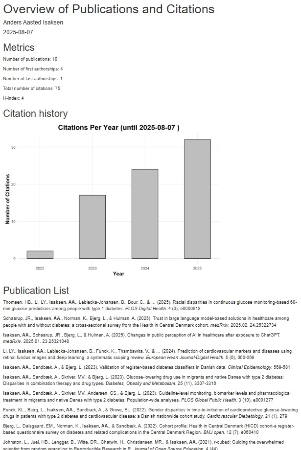

#  rcademic, a small collection of scripts to automate boring tasks in academia

Currently, only one Rmarkdown script is included, which uses the excellent `scholar`  *R* package to create reproducible publication lists

Just edit the script to use your Google Scholar ID and edit the processing pipeline to suit your needs. Then knit to your preferred format and you should get an output similar to this:

